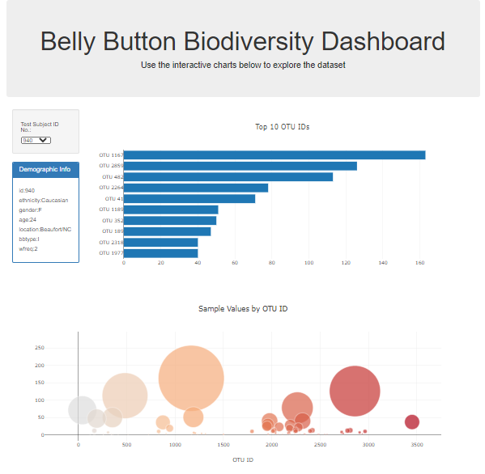

# Web Visualizations Dashboard

#### Belly Button Biodiversity

This challenge uses the [Belly Button Biodiversity dataset](http://robdunnlab.com/projects/belly-button-biodiversity/), which catalogs the microbes that colonize human navels.  It specifically looks at microbial species (also called operational taxonomic units, or OTUs, in the study) found in different people.  I used javascript, with a combination of d3 and plotly, to build an interactive dashboard.  The dashboard includes:

- A horizontal bar chart of the top 10 OTUs found in an individual.
- A bubble chart that lets you see all OTUs find in that individual vs the quantity found in samples.
- A demographic section that lists basic demographic information of the selected individual.
- A dropdown list that updates the charts as you toggle between different individuals.

The dashboard can be found here: [Live Link](https://saleha456.github.io/Web-Visualizations-Challenge/)

